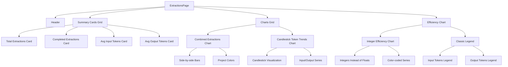
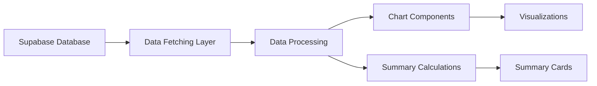

# Extraction Analytics Page Architecture

## Updated Component Structure

## Data Flow

## Key Updates

1. **Chart Styling**: Using project's hsl(var(--chart-N)) color variables
2. **Combined Extractions**: Side-by-side bars for total vs completed extractions
3. **Summary Cards**: Avg output tokens replacing total raw grants
4. **Token Trends**: Candlestick chart style for daily token usage
5. **Efficiency Metrics**: Integer values with classic legend
6. **Responsive Design**: All components adapt to screen sizes