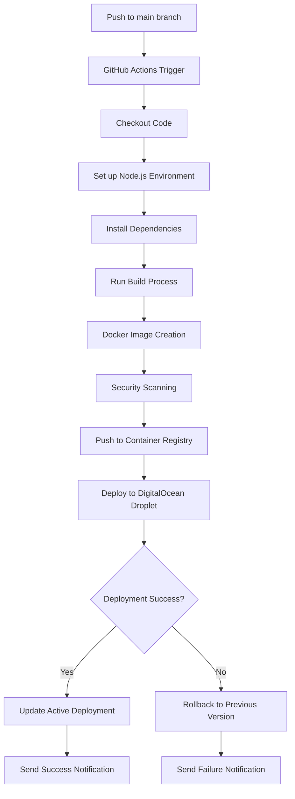

# Grant Pipeline Dashboard CI/CD Architecture Plan

## Overview
This document outlines the complete CI/CD architecture for the Grant Pipeline Dashboard application, implementing automated deployment to a DigitalOcean droplet on every push to the main branch.

## CI/CD Workflow Architecture

## Workflow Triggers
- **Primary Trigger**: Push to `main` branch
- **Manual Trigger**: Workflow dispatch for manual deployments
- **Scheduled Trigger**: Weekly security scans

## Build Process (Docker Image Creation)

### Docker Build Strategy
The application uses a multi-stage Docker build process to optimize image size and security:

1. **Build Stage**: 
   - Use `node:20-alpine` as base image
   - Install dependencies with `npm ci`
   - Build Next.js application with `npm run build`
   - Remove development dependencies

2. **Production Stage**:
   - Copy built application from build stage
   - Use minimal runtime environment
   - Expose port 3000
   - Start application with `npm start`

### Build Optimization
- Cache Docker layers for faster builds
- Use `.dockerignore` to exclude unnecessary files
- Multi-stage build to reduce final image size

## Security Scanning Steps

### Static Analysis
- **Dependency Scanning**: Check for vulnerable npm packages using npm audit
- **Code Scanning**: GitHub Advanced Security for code vulnerabilities
- **Secrets Scanning**: Automatic detection of hardcoded secrets

### Container Security
- **Image Scanning**: Trivy for container vulnerability scanning
- **Base Image Validation**: Verify official base images
- **Runtime Security**: Docker security best practices

## Testing Phases
*Note: As per user requirements, comprehensive testing is not currently implemented but the framework is in place for future expansion.*

### Current Testing Approach
- **Build Validation**: Ensure application builds successfully
- **Basic Health Check**: Verify application starts without errors
- **Docker Image Validation**: Confirm container runs properly

### Future Testing Expansion
- Unit tests with Jest
- Integration tests for API endpoints
- End-to-end tests with Cypress
- Performance testing with Artillery

## Deployment Strategy to DigitalOcean Droplet

### Deployment Method
- **SSH Deployment**: Secure deployment via SSH to DigitalOcean droplet
- **Zero-Downtime Deployment**: Blue-green deployment strategy
- **Rolling Updates**: Gradual rollout to minimize service disruption

### Deployment Process
1. **Pre-deployment Checks**:
   - Verify SSH connectivity to droplet
   - Check available disk space
   - Validate deployment credentials

2. **Application Deployment**:
   - Pull latest Docker image
   - Stop current container
   - Start new container with updated image
   - Verify application health

3. **Post-deployment Validation**:
   - Health check endpoint verification
   - Basic functionality testing
   - Performance monitoring initialization

## Environment Management for Secrets

### Required Secrets
The following secrets need to be configured in GitHub repository settings:

| Secret Name | Description | Usage |
|-------------|-------------|-------|
| `DIGITALOCEAN_HOST` | Droplet IP address | SSH deployment target |
| `DIGITALOCEAN_USERNAME` | SSH username | Deployment authentication |
| `DIGITALOCEAN_SSH_KEY` | Private SSH key | Secure droplet access |
| `SUPABASE_URL` | Supabase project URL | Application database connection |
| `SUPABASE_ANON_KEY` | Supabase anonymous key | Client-side API access |
| `DOCKER_REGISTRY_TOKEN` | Container registry token | Image push authentication |

### Secret Management Best Practices
- All secrets stored in GitHub Actions secrets
- No hardcoded credentials in source code
- Regular credential rotation
- Principle of least privilege for access tokens

## Rollback Procedures

### Automated Rollback
- **Trigger Condition**: Deployment failure or health check failure
- **Rollback Process**:
 1. Automatically detect deployment failure
  2. Revert to previous Docker image version
  3. Restore previous container configuration
  4. Verify rollback success

### Manual Rollback
- **GitHub Interface**: Use GitHub Actions UI to redeploy previous workflow runs
- **Command Line**: Manual Docker image rollback via SSH
- **Version Control**: Tag-based rollback to specific commits

### Rollback Validation
- Health check verification after rollback
- Functionality testing of rolled-back version
- Notification of rollback completion

## Monitoring and Notifications

### Deployment Notifications
- **Success Notifications**: Slack/Email notification on successful deployment
- **Failure Notifications**: Immediate alert on deployment failure with error details
- **Rollback Notifications**: Alert when automatic rollback is triggered

### Health Monitoring
- **Application Health**: Continuous monitoring of application endpoints
- **Resource Usage**: CPU, memory, and disk usage tracking
- **Error Tracking**: Integration with error monitoring services

### Performance Monitoring
- **Response Time**: API response time tracking
- **Uptime Monitoring**: Application availability monitoring
- **User Experience**: Frontend performance metrics

## Implementation Roadmap

### Phase 1: Core CI/CD Pipeline (Current)
- [x] GitHub Actions workflow setup
- [x] Docker image building
- [x] Basic security scanning
- [x] DigitalOcean deployment
- [x] Environment secret management
- [x] Basic rollback capability
- [x] Deployment notifications

### Phase 2: Enhanced Security (Future)
- [ ] Advanced vulnerability scanning
- [ ] Compliance checking
- [ ] Security policy enforcement
- [ ] Automated security patching

### Phase 3: Comprehensive Testing (Future)
- [ ] Unit test integration
- [ ] Integration testing framework
- [ ] End-to-end test automation
- [ ] Performance testing suite

### Phase 4: Advanced Monitoring (Future)
- [ ] Comprehensive observability
- [ ] Log aggregation and analysis
- [ ] Alerting and incident management
- [ ] Business metrics tracking

## Best Practices Implemented

### Security Best Practices
- No secrets in source code
- Regular security scanning
- Principle of least privilege
- Secure SSH configuration

### Deployment Best Practices
- Zero-downtime deployments
- Automated rollback capability
- Health check validation
- Environment isolation

### Operational Best Practices
- Comprehensive logging
- Monitoring and alerting
- Documentation and runbooks
- Regular maintenance windows

## Conclusion
This CI/CD architecture provides a robust, secure, and automated deployment pipeline for the Grant Pipeline Dashboard application. The pipeline ensures that updates are automatically deployed to the DigitalOcean droplet while maintaining security, reliability, and observability. The modular design allows for future enhancements and scaling as the application grows.